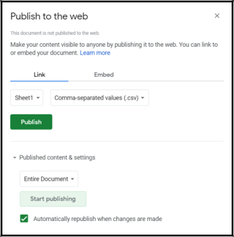

# Leaflet-ODK-Spreadsheet
Visualize the odk collect spreadsheet into a web map leafletjs

---

## Publish Spreadsheet to CSV
1. Select **File - Publish to the web**
2. On the **Link** tab, select **Sheet1** or whatever your sheet name in the first dropdown menu
3. Select **Comma-separated values (.csv)** in the second dropdown menu
4. Click **Publish** button

---

## Workflow
1. Spreadsheets are made into GeoJSON Service using php in the geojson.php file
2. GeoJSON service is shown as a point layer in the web map leafletjs

---

## Example
> [https://unsorry.net/git/leaflet-odk-spreadsheet/](https://unsorry.net/git/leaflet-odk-spreadsheet/)

---

`unsorry@2021`